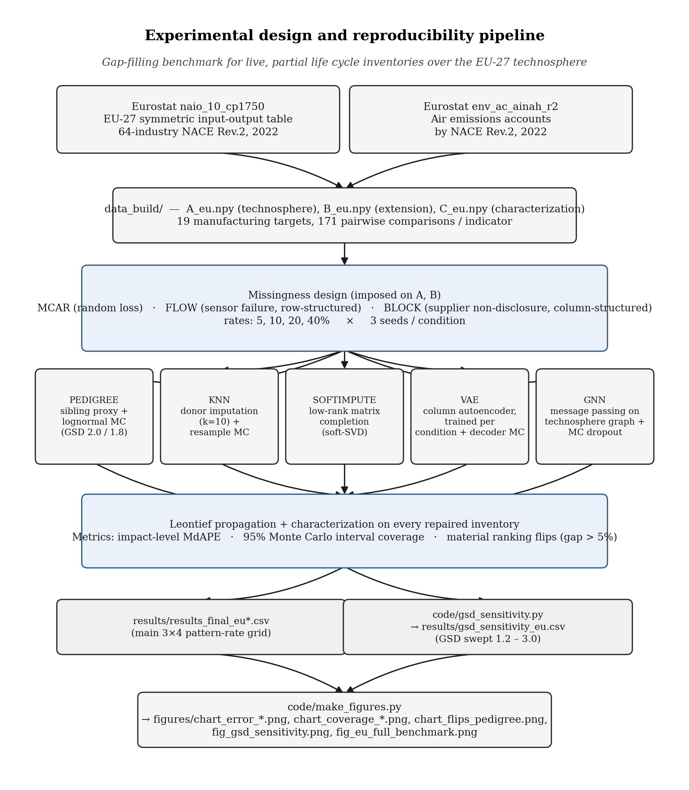

# Imputation or Acquisition? An EU-27 Benchmark Locating the Boundary of Gap-Filling in Live Life Cycle Inventories

Companion repository for the manuscript submitted to the 34th CIRP Conference on
Life Cycle Engineering (CIRP LCE 2027):

> T. A. Khan, R. Kumar, F. Cerdas, K. S. Sangwan, N. Khanna, "Imputation or
> Acquisition? An EU-27 Benchmark Locating the Boundary of Gap-Filling in Live
> Life Cycle Inventories", Procedia CIRP, 34th CIRP LCE 2027.

All data are official EU statistics, retrieved from public Eurostat API endpoints.
No license, registration, or paid data access is required to reproduce any result
in this repository. (Working title above: "Decision cost of incomplete life cycle
inventories" — retained in `CHANGELOG.md` for provenance; the manuscript title is
the one above.)

**Reproducibility status:** every number below was regenerated from the included
`data_build/` matrices, independently re-run across three review passes (most
recently after fixing a data-leakage bug in the PEDIGREE/KNN repair functions and
a latent mask-generation bug for the FLOW pattern in the GSD sweep — see
`CHANGELOG.md`), and confirmed bit-exact across all runs in every pass.



**Fig. A1.** Experimental design and reproducibility pipeline: Eurostat data build,
the missingness design (pattern x rate x seed) applied identically to all five
repair methods, propagation through the Leontief inverse and characterization, and
the downstream metrics, GSD-sensitivity, and figure-generation stages. Boxes name
the exact script or artifact responsible for each stage; see
[Experiment design](#experiment-design) below for the full description.

## Data build

Two Eurostat datasets, both reference year 2022, geography EU27_2020:

- **naio_10_cp1750** — EU-27 symmetric input-output table, industry by industry,
  NACE Rev. 2 at 64-industry detail, current prices (million EUR).
- **env_ac_ainah_r2** — air emissions accounts by industry, NACE Rev. 2.

Technosphere matrix A is built as Z / x (intermediate use over industry output, row P1).
Environmental extension B is built as emissions over industry output. Characterization
matrix C uses Eurostat's own published aggregation groups: greenhouse gases (CO2
equivalents), acid gases (SO2 equivalents), tropospheric ozone precursors (NMVOC
equivalents), and primary PM2.5. One industry (U, extraterritorial organisations) has
zero output in the table and is excluded from the extension.

Build validation: summed mapped-industry GHG emissions reproduce the Eurostat-published
EU-27 total within 0.2%.

Retrieval endpoints (no key required):
```
https://ec.europa.eu/eurostat/api/dissemination/statistics/1.0/data/naio_10_cp1750?format=JSON&unit=MIO_EUR&stk_flow=TOTAL&geo=EU27_2020&time=2022
https://ec.europa.eu/eurostat/api/dissemination/statistics/1.0/data/env_ac_ainah_r2?format=JSON&geo=EU27_2020&time=2022&unit=THS_T
```

Built matrices (`A_eu.npy`, `B_eu.npy`, `C_eu.npy`, `meta_eu.json`) are included in
`data_build/` so the benchmark can be rerun without re-hitting the API. Data extracted
6 July 2026; cite both dataset codes and this extraction date in any Data Availability
statement, since Eurostat revises these tables periodically.

## Experiment design

Targets: 19 manufacturing industries (NACE C10-12 through C33), 171 pairwise comparisons
per indicator. Three missingness patterns are imposed on A and B: random loss (MCAR),
sensor failure (FLOW, structured by elementary flow), and supplier non-disclosure
(BLOCK, entire columns unknown). Rates: 5, 10, 20, 40%. Three seeds per condition,
for all methods.

Five repair methods are compared on identical masks:
- **PEDIGREE** — sibling-group (NACE section) proxy substitution with pedigree-style
  lognormal uncertainty widening (GSD 2.0 technosphere, 1.8 extension), current
  standard practice.
- **KNN** — donor-column imputation (k=10, distance-weighted) with donor-resampling
  Monte Carlo for uncertainty.
- **SOFTIMPUTE** — low-rank matrix completion via iterative soft-thresholded SVD.
- **VAE** — column-wise variational autoencoder, trained per condition on observed
  entries only, decoder-sample Monte Carlo for uncertainty.
- **GNN** — two-layer message-passing network over the technosphere adjacency
  (hand-implemented, no external graph library), MC-dropout for uncertainty.

Neural network outputs are clamped in log-space to the observed data range before
inverse transform, a standard stabilization step; see Limitations for what this does
and does not fix.

Metrics, all computed after propagation through impact assessment: impact-level median
absolute percentage error (MdAPE) per indicator, 95% Monte Carlo interval coverage,
and material pairwise ranking flips (true gap > 5%).

## Headline findings (verified against results/ CSVs, regenerated in this repo)

1. **Pedigree-widened uncertainty intervals never reach their nominal level.** Across
   the twelve pattern-rate conditions, coverage of nominal 95% intervals ranges from
   9.2% (random loss at the 20% rate) to 78.9% (sensor failure at the 10% rate), and
   falls below 30% in six of the twelve conditions. The regime that comes closest to
   nominal coverage is sensor failure at low rates, and even there it falls well short.

2. **This is not an artifact of the specific GSD assumption, and widening the factor
   further does not reliably help — evidenced across every pattern, not just two.** A
   sensitivity sweep over GSD from 1.2 to 3.0 (the plausible pedigree range) across the
   full grid (all three patterns, all four rates) shows coverage peaking at 45.2%
   (supplier blocks, 40% rate, GSD 2.5) and *declining* again by the widest setting
   tested (41.2% at GSD 3.0, same condition); 5 of the 12 swept conditions decline
   past their peak, while the other 7 (including all sensor-failure rates) rise
   toward a plateau still far below nominal. The sweep now also covers sensor failure
   at the 10% rate — the single condition most favorable to pedigree in the main grid —
   and even there coverage only reaches 84.6% at the widest GSD tested. No condition
   anywhere in the 60 pattern-rate-GSD combinations swept reaches nominal 95%. See
   `results/gsd_sensitivity_eu.csv` and `figures/fig_gsd_sensitivity.png`.

3. **KNN donor imputation is the better-calibrated method under entrywise missingness,
   though not by as wide or as uniform a margin as the code first suggested (see Fixed
   issues below).** Under random loss and sensor failure, KNN's donor-resampling
   intervals achieve 66-88% coverage, against pedigree's 9-79% in the same conditions —
   KNN is higher in seven of the eight rate-pattern combinations and statistically tied
   with pedigree at the eighth (sensor failure, 10% rate: 78.9% for both). Point
   accuracy is comparable between the two rather than uniformly better for either
   (pedigree holds a moderate accuracy advantage at the highest rate: 33.6% vs. 40.9%
   median error at the 40% rate under random loss).

4. **No method recovers reliable estimates under supplier non-disclosure — though KNN
   and pedigree are not fully independent under this pattern.** When entire columns are
   unknown, coverage collapses for every method (at most 75.4%, KNN at the 10% rate),
   and the plain pedigree baseline is the most accurate of the five at the 40% rate:
   14.6% median error, against 24.6% for KNN, 34.4% for the VAE, 41.5% for SoftImpute,
   and 75.9% for the GNN. This indicates block missingness is a data-acquisition
   problem, not an imputation problem. Under this pattern, however, KNN's donor search
   routinely finds no jointly-observed candidate and falls back to the same
   sibling-averaging rule as the pedigree baseline, so this comparison is one repair
   strategy under two uncertainty treatments more than two independent methods (see
   Limitations). The BLOCK candidate pool also excludes the 19 target (manufacturing)
   industries by construction, so this describes non-disclosure by an upstream
   supplier, not by a target industry itself.

5. **Model complexity does not track reliability.** Under sensor failure at the 40%
   rate, three of the five methods show severe instability: the VAE reaches 289%
   median error (driven by one of three seeds exceeding 700%), the GNN reaches 120%,
   and SoftImpute reaches 116% — all far above pedigree's 11.8% and KNN's 10.8% at the
   same condition. (These three unstable methods share the same per-condition seeds, so
   the single-seed VAE spike is not independent evidence for all three — but the GNN and
   SoftImpute use unrelated algorithms and both still exceed 100% at the same
   condition.) The GNN's MC-dropout intervals are separately severely overconfident
   under random loss (coverage never exceeding 3.5%). None of the three more complex
   methods consistently outperforms the far simpler donor-based approach on either
   accuracy or calibration.

6. **Decision stability is a distinct question from point error.** Random loss produces
   the most pairwise ranking reversals under the pedigree baseline (14.8% at the 40%
   rate), while supplier non-disclosure produces only 3.2% despite causing larger point
   errors — sibling-average substitution biases whole product families in the same
   direction, so bias partly cancels in a pairwise comparison, while random loss
   produces uncorrelated errors that do not cancel.

## Fixed issues (this pass — see CHANGELOG.md for full detail)

An independent 5-reviewer methodological audit of this repository and the companion
manuscript found two code-level issues and three manuscript-level issues, all now
fixed:

- **Data leakage in PEDIGREE/KNN repair** — both functions averaged sibling/donor
  values from the true, unmasked matrices rather than excluding other currently-masked
  cells, which could inflate their accuracy and calibration under MCAR/FLOW. Fixed to
  mask-aware averaging; PEDIGREE and KNN numbers under MCAR/FLOW shifted by up to a few
  percentage points (BLOCK numbers were unaffected — see CHANGELOG.md for the
  condition-by-condition diff). SoftImpute, VAE, and GNN were already leakage-free and
  are numerically unchanged.
- **Latent FLOW mask-generation bug in `gsd_sensitivity.py`** — this script's
  `make_masks()` never had a real FLOW branch; it silently fell through to BLOCK-style
  column masking. Harmless while the sweep never included FLOW; caught the moment FLOW
  was added to the sweep (finding #2 below). Fixed to mirror
  `experiment_final_eu.py`'s FLOW branch exactly.
- **GSD sweep excluded FLOW entirely** (previously only MCAR/BLOCK at 20%/40%) —
  extended to the full 3-pattern x 4-rate grid.
- **Table 1's Coverage column mixed conditions its own caption didn't claim** — every
  column now reports the BLOCK@40% condition its caption states.
- **KNN silently degrading to PEDIGREE under BLOCK, and the Rubin-taxonomy framing of
  the missingness patterns, were undisclosed in the manuscript body** — both are now
  disclosed at the point they matter (see the manuscript's Section 4.4 and Limitations).

All fixes were re-verified bit-exact reproducible (see CHANGELOG.md).

## Figures manifest

`figures/fig_eu_full_benchmark.png` — combined 2x3 grid, all patterns, error and
calibration.
`figures/fig_gsd_sensitivity.png` — GSD sweep, all conditions, combined.

Individual charts (one panel each, for manuscript figure selection):
- `chart_error_MCAR.png` / `chart_coverage_MCAR.png` — random loss, error and
  calibration.
- `chart_error_FLOW.png` / `chart_coverage_FLOW.png` — sensor failure, error and
  calibration.
- `chart_error_BLOCK.png` / `chart_coverage_BLOCK.png` — supplier non-disclosure,
  error and calibration.
- `chart_flips_pedigree.png` — material ranking flips under the pedigree baseline,
  all three patterns overlaid (decision-stability result, not in the combined figure).

All figures are regenerated from `results/` by `code/make_figures.py` — they are not
committed as hand-edited artifacts.

## Limitations

- Three seeds per condition; results are directionally stable but a larger seed
  count would tighten the exact crossover points. The VAE's 289% figure at FLOW/40%
  in particular is driven by one high-variance seed (see `CHANGELOG.md`).
- This is an input-output testbed (64 industries), not a process-based inventory.
  The masking and evaluation logic transfer unchanged to process-based databases;
  that validation is future work.
- Log-space clamping bounds individual entry reconstructions to the observed range
  but does not prevent degradation once many imputed entries compound through the
  Leontief inverse; this is reported as a finding (point 5), not resolved.
- KNN's block-pattern fallback (when fewer than 5 industries are jointly observed)
  degrades to sibling averaging, making it non-independent from the pedigree baseline
  under BLOCK specifically (finding 4); a hybrid estimator with a different fallback is
  a straightforward extension.
- The BLOCK candidate pool is restricted to the 45 non-manufacturing industries by
  construction, so finding 4 ("no method survives supplier non-disclosure") describes
  non-disclosure by an upstream supplier, not by one of the 19 target industries
  directly; whether it extends to target-industry non-disclosure is untested here.
- The GSD sensitivity sweep now covers the full 3-pattern x 4-rate grid with the
  baseline method (previously only MCAR/BLOCK at 20%/40% — see CHANGELOG.md).
- The PEDIGREE/KNN repair functions were leakage-free only after this pass's fix (see
  "Fixed issues" above); SoftImpute, VAE, and GNN never had this issue.

## Reproducing

```
pip install -r requirements.txt
cd code
python experiment_final_eu.py MCAR
python experiment_final_eu.py FLOW
python experiment_final_eu.py BLOCK
python gsd_sensitivity.py
python make_figures.py
```

Scripts resolve the built matrices from `../data_build/` automatically, and write
result CSVs to `../results/` (falling back to the working directory if `results/`
doesn't exist). `make_figures.py` reads `results/` and (re)writes everything in
`figures/`. No GPU, no license, no registration. The full grid completes in well
under a minute on a single CPU core.

Environment used for the results in `results/`: Python 3.12, numpy 2.4.4,
pandas 3.0.2, torch 2.13.0 (CPU). Reproducibility does not depend on exact package
versions — the seed derivation is fixed and explicit (see `CHANGELOG.md`) and every
stochastic step uses `numpy.random.default_rng` or a fixed `torch.manual_seed`, not
Python's process-randomized `hash()`.

## License

Code in this repository is released under the MIT License (see `LICENSE`). The
underlying Eurostat data (`data_build/*.npy`, `meta_eu.json`) are derived from
Eurostat's public dissemination API and are reusable under Eurostat's own terms,
which require acknowledgement of the source; see
https://ec.europa.eu/eurostat/about/policies/copyright.
